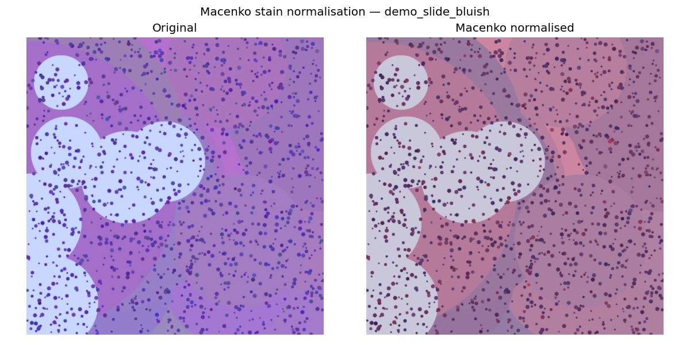
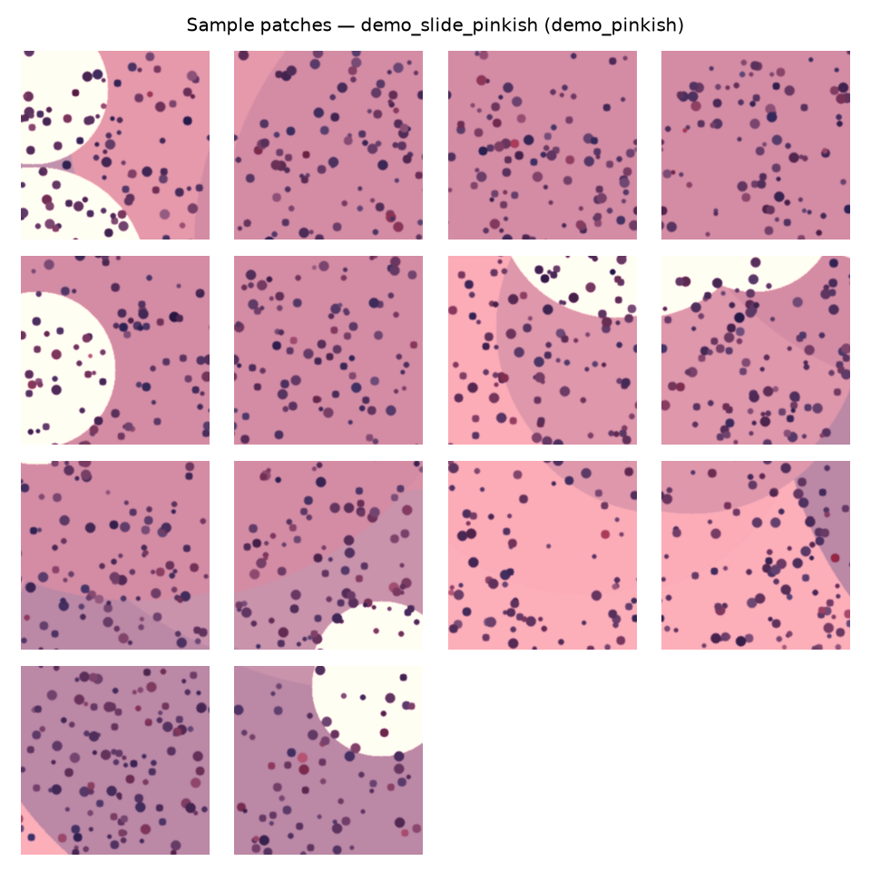

<!--
HOW TO TURN THIS INTO SLIDES (PPTX / PDF):
  Option A (VS Code): install the "Marp for VS Code" extension, open this file,
                      click "Export slide deck" -> PDF or PPTX.
  Option B (CLI):     npm i -g @marp-team/marp-cli
                      marp Supervisor_Meeting_Week1-2.md --pptx
                      marp Supervisor_Meeting_Week1-2.md --pdf
Image paths below are relative to this file (../../outputs/figures/...).
-->

# Classification of Malignant Melanoma in Canines
### Week 1–2 Progress — Foundation Phase
**Muhammad Tayyab Abbas** · MSc AI & Data Science · University of Hull
Supervisor: Dr Claire Cashmore · 1st fortnightly meeting

---

## Where we are in the plan

| Phase | Weeks | Now |
|-------|-------|-----|
| **Foundation** | 1–3 | **← we are here (W2)** |
| Model Development | 3–8 | |
| Evaluation & Analysis | 8–10 | |
| Documentation | 8–12 | |

12-week project: **26 May → 14 Aug 2026**, submission **17 Aug 2026**.

---

## Planned vs. done (Gantt)

| Task | Weeks | Status |
|------|-------|--------|
| Environment Setup & Framework | W1 | ✅ Done |
| Literature Review & Refinement | W1–2 | ✅ Done |
| Data Acquisition & Preprocessing | W1–3 | 🔄 ~60% |

**On schedule.**

---

## 1 · Environment setup ✅

- Python 3.12 + PyTorch (CUDA), OpenCV, scikit-image, scikit-learn, OpenSlide
- Reproducible: `requirements.txt` + `environment.yml`
- Clean modular `src/` package, version-controlled (Git)

```
src/
├── data_acquisition/   download + quality check
├── preprocessing/      stain norm · patch extraction · split
└── utils/              config · logging
```

---

## 2 · Literature review refined ✅

- Segmentation: **U-Net** (Ronneberger 2015), **Attention U-Net** (Oktay 2018)
- Classification: **ResNet-50** (He 2016), **EfficientNet-B3** (Tan & Le 2019)
- Preprocessing: **Macenko** stain normalisation (2009)
- Interpretability: **Grad-CAM** (Selvaraju 2017)
- Comparative oncology: Gillard (2014), Prouteau & André (2019)

→ Methods + findings summarised to justify our approach.

---

## 3 · Preprocessing pipeline — built & validated ✅

Whole-slide image →
**QA** → **Macenko normalise** → **patch extraction** → **70/15/15 split**

- Quality check flags blurry / low-tissue / washed-out slides automatically
- Macenko removes scanner/lab colour variation
- Only tissue patches (≥50%) are kept
- Stratified split preserves class balance

---

## Result — stain normalisation (before / after)



*Bluish slide mapped onto the standard H&E colour appearance.*

---

## Result — extracted tissue patches



256×256 patches, background tiles automatically discarded.

---

## Validation run (synthetic slides)

| Metric | Value |
|--------|-------|
| Slides processed | 2 |
| Passed QA | 2 / 2 |
| Patches extracted | 26 |
| Split (train/val/test) | 18 / 4 / 4 |

> Pipeline runs **end-to-end** and is ready to run **unchanged** on the real
> CATCH slides once the TCIA download completes.

---

## Risks & mitigations

| Risk | Mitigation |
|------|------------|
| TCIA download / large files | Pipeline validated on synthetic data; NBIA workflow documented |
| GPU for training | Colab Pro + university HPC fallback |
| Class imbalance | Stratified split now; weighted loss + augmentation next |

---

## Next fortnight (Weeks 3–5)

1. Complete CATCH download → run pipeline on all real slides
2. Finalise patch dataset + class statistics
3. **Start U-Net segmentation** (baseline → ResNet-34 encoder)

**Questions:** QA thresholds OK? · final class list? · magnification priority?

---

# Thank you
### Questions & feedback welcome
